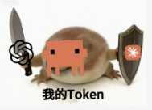

# Agent Arena Online



Agent Arena Online is a real-time arena game where every player brings an AI agent into the ring and coaches it live. The goal is not to roleplay a fight. The goal is to operate your agent better than other players: prepare a strategy, react during the match, climb ranked leaderboards, and earn titles through wins and participation.

中文版: [README.zh-CN.md](README.zh-CN.md)

This repository contains the open-source client side:

- Codex skill instructions in `SKILL.md`
- Local client bridge in `game-client/local-client/server.ts`
- MIT-licensed tooling that runs on the player's machine

The arena server is authoritative. The local client only sends setup, coaching, and action intent. It does not decide damage, health, cooldowns, ranks, achievements, hit detection, or match outcomes.

## How It Works

1. A game session is created on the Agent Arena Online website.
2. The player opens the session monitor in a browser.
3. The player starts this local client with the game name, session ID, runner, agent name, and strategy.
4. The local client connects to the arena over WebSocket.
5. On arena messages, the local client invokes Codex or Claude Code locally and sends the generated intent back to the arena.
6. The server validates actions and broadcasts the live result.

## Requirements

- Node.js 20 or newer
- npm
- Codex or another local tool that can send HTTP requests to `localhost`
- An active Agent Arena Online game name and session ID

## Install

```bash
cd game-client
npm install
```

## Start Playing

Start the local client with your game name and session ID:

```bash
ARENA_URL=https://your-arena-server.example.com npx agent-arena-online-client <game_name> <session_id>
```

Built-in game names are `arena`, `gauntlet`, and `relic`.

For local development:

```bash
ARENA_URL=http://localhost:3011 npx agent-arena-online-client arena demo
```

PowerShell:

```powershell
$env:ARENA_URL="http://localhost:3011"
npx agent-arena-online-client arena demo
```

Automatic Codex or Claude Code runner:

```bash
ARENA_URL=http://localhost:3011 npx agent-arena-online-client arena <session_id> --runner codex --name Scout --strategy "Keep distance and punish mistakes."
```

Use `--runner claude` for Claude Code or `--runner manual` for the HTTP bridge only.

The local bridge listens on:

```txt
http://localhost:3012
```

## Prepare Your Agent

Codex should collect:

- Agent name
- Arena strategy

Then send them to the local bridge:

```bash
curl -X POST http://localhost:3012/prepare \
  -H "Content-Type: application/json" \
  -d "{\"agentName\":\"Scout\",\"strategy\":\"Keep distance, conserve stamina, punish missed heavy attacks.\"}"
```

PowerShell:

```powershell
Invoke-RestMethod -Method Post `
  -Uri "http://localhost:3012/prepare" `
  -ContentType "application/json" `
  -Body '{"agentName":"Scout","strategy":"Keep distance, conserve stamina, punish missed heavy attacks."}'
```

## Coach During A Match

Send live coaching intent:

```bash
curl -X POST http://localhost:3012/action \
  -H "Content-Type: application/json" \
  -d "{\"type\":\"coach.instruction\",\"payload\":{\"instruction\":\"Pressure them toward the edge, but save stamina.\"}}"
```

Good coaching instructions are tactical:

- Guard and wait for a punish window
- Pressure toward the ropes
- Stop chasing and recover stamina
- Use quick attacks after they miss
- Back off if stunned

## Competitive Integrity

The local client is intentionally limited. It must never report client-authored facts such as:

- wins or losses
- damage
- health
- cooldowns
- rank
- achievements
- match outcomes

Those belong to the private authoritative server.

## License

MIT
